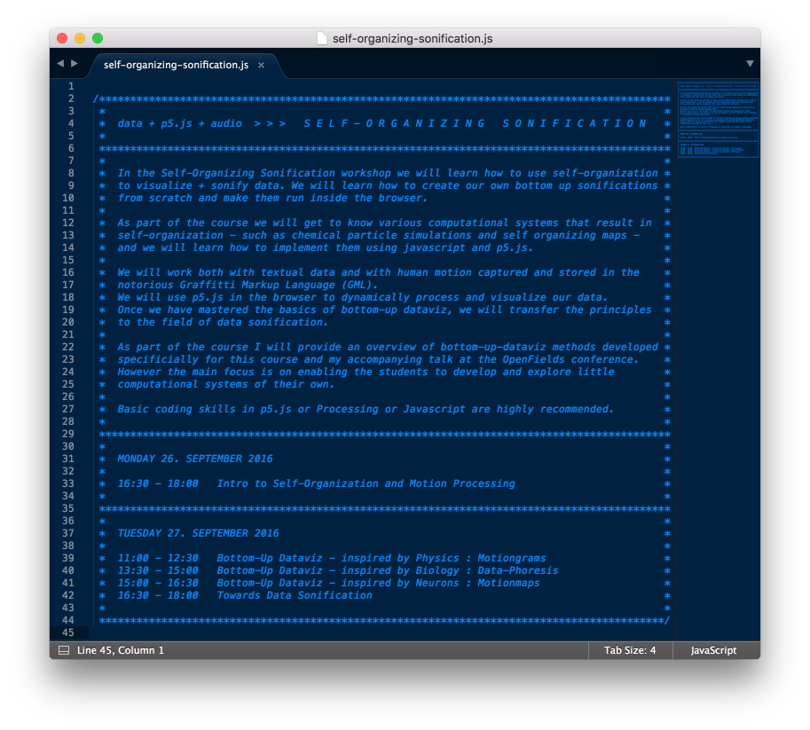
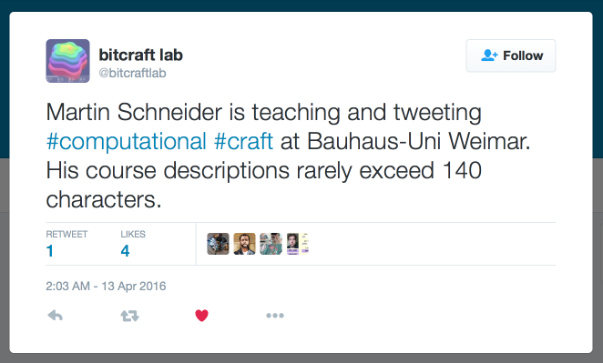

# SELF-ORGANIZING SONIFICATION

*An introduction to self-organization and bottom-up data-sonification*

## data + p5.js + audio

*Here's the schedule of the course. click it if you dare.*

## about

*My CV in a tweet ;-)*

## license

*All code in this repository is released under the [MIT License](LICENSE.md).*
