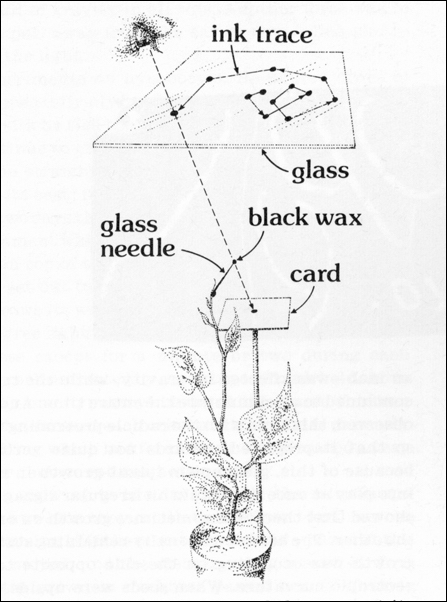
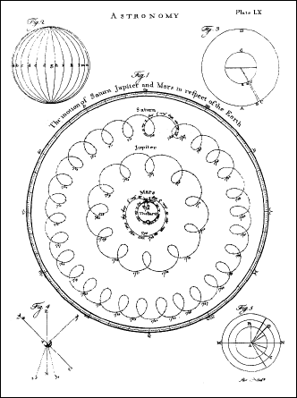
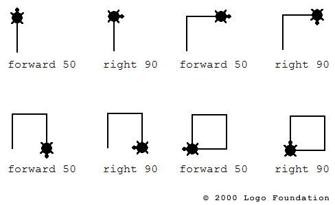
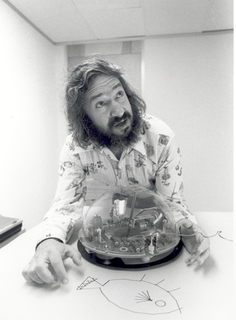

# *SELF-ORGANIZING SONIFICATION*
## 1. INTRODUCTION AND OVERVIEW

*This session introduces the concept of self-organization and shows how motion can be represented and processed inside a computer.*

## Intro to Self-Organisation
### Topics

* John Conway's *Game of Life*
* Craig Raynold's *Boids*
* Emergence, Perception, Superzeichen
* Artificial Chemistry

### Examples

* Conway's **Game of Life**
* Craig Raynold's **Boids**
* Martin Schneider's **Poetic Polymers**

### Demos

Check out the [demo page](demos) of this section,  
to run the demos, and explore the source code.

* tapeworm
* magnetic bubbles
* bouncing bubbles

### Literature

**EMERGENCE** — from Chaos to Order — by [John Holland](https://www3.beacon-center.org/blog/2015/08/13/passing-of-prof-john-holland-father-of-genetic-algorithms-and-pioneer-in-complex-systems/), inventor of Genetic Algorithms.

### Software

**GOLLY** — for exploring cellular automata like the Game of Life.

**READY** — for exploring Reaction-Diffusion systems on various grids and meshes

### Resources

* Martin Schneider's [***Self-Organization by Design***](https://www.uni-weimar.de/kunst-und-gestaltung/wiki/GMU:Self-Organization_by_Design) class.
  *  Processing Code for [Computational Systems](https://github.com/bitcraftlab/Self-Organization_by_Design_I), [Geometric Systems](https://github.com/bitcraftlab/Self-Organization_by_Design_II) and [Natural Systems](https://github.com/bitcraftlab/Self-Organization_by_Design_III).
* Dan Shiffman's [***Nature of Code***](http://natureofcode.com/) book
  *  [Processing Code](https://github.com/shiffman/The-Nature-of-Code-Examples)
  *  [P5.js Code](https://github.com/shiffman/The-Nature-of-Code-Examples-p5.js)

## Intro to Motion Processing

A path of motion through time is called a **trajectory**.  
Motion processing is about storing trajectories inside a computer,  processing them, comparing them, and visualizing them.

### Digitizing Motion

To be able to process real world motion inside a computer, we must first digitize it:

* **Quantization** →  discrete steps in space (precision)
* **Sampling** → discrete steps in time (sampling rate)

You may know the digitization process from image and audio signal processing.
Digitization of motion works pretty much in the same way. Continuous motion is turned into a digital approximation, that approaches the original signal to arbitrary precision.

### Popular Motion

A popular motion signal that you already know is the Audio-Signal (Motion of Air-Pressure).

* 1D-Motion-Processing → Audio Signal
* 2D-Motion-Processing → Drawing and Writing
* 3D-Motion-Processing → Motion-Tracking

### Sonifying Motion

A direct way of motion sonification is to to speed up a motion-signal so it's in the [audible domain](https://en.wikipedia.org/wiki/Hearing_range) (20 - 20.000 Hz).
The motion can then directly drive the membrane of an audio speaker, so we can make it audible.

In this course we will take a more indirect approach:
We will first create bottom-up data-visulizations using self-organisation, and then think about how we can turn the spacial arrangements and curves we have created into sound.

## Motion Coding

Motion coding is the art of representing motion.  
People have been doing this for quite some time. It's called astronomy → It's tricky!

Note: Motions may look very different, depending on your point of view.

Once central question:
> When are two motions the same?

More constructively:  
> Is there a representation that makes it easy to check if two motions are the same?

### Spacial Motion Coding

Each motion in space is stored as a sequence of locations in our coordinate system.

* motion always in relation to the absolute coordinate system
* change in orientation or scaling makes it hard to compare motions

For 2D motion we simply provide a list of `(x, y)` values, encoding the position of a person.

Which trajectory is represented by this code?

`(0, 0), (0, 1), (1, 1), (1, 0) (0, 0)`

### Turtle Motion Coding

We can also take a mover-centric approach and encode our path from the perspective of the mover.

* For each new sample we encode its position relative to the previous location of the mover
* The main axis of the coordinate system is also relative to the mover (heading direction)

For 2D-Motions we simply store a pair of values ``(distance, angle)`` for each step. This approach has been popularized by Seymour Papert and the LOGO turtle.

The turtle motion code for the turtle walking in a square would be:

`(90, 1), (90, 1), (90, 1), (90, 1)`

### Processing Motion

Motion represented in this way is just a sequence of values, so we can do all kinds of awesome computer-sciency stuff:

* Interpolate between two motions → Sexy!
* Add, Subtract, Multiplay Motions and see what happens!
* Sort motion trajectories and display them
* Write a complete Motion Processing Suite, with motion filters etc. → Adobe Motionshop

## Graffitti Markup Language

A Universal, XML-based, open file format designed to store graffiti motion data.

Various clients for recording and replaying GML have been developed over the years.  
For our purpose we are mostly interested in [javascript](http://www.graffitimarkuplanguage.com/tag/javascript/) code.
