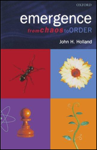
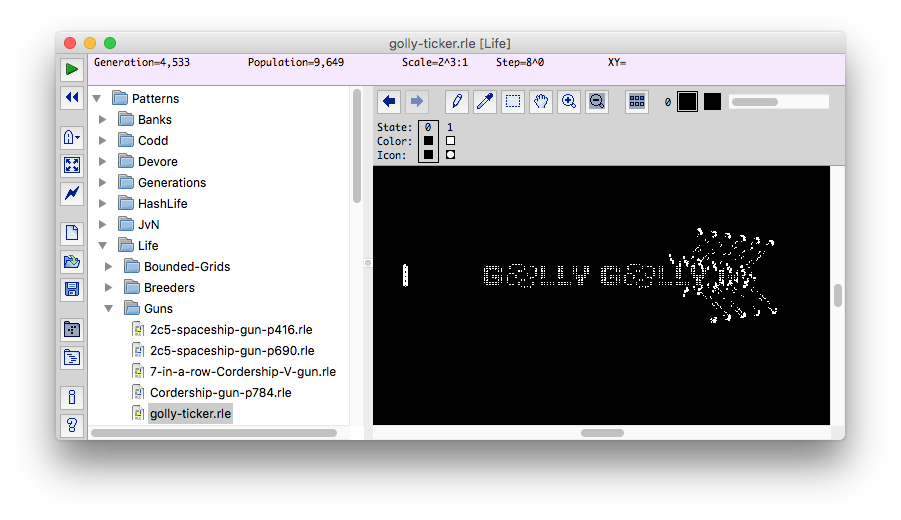
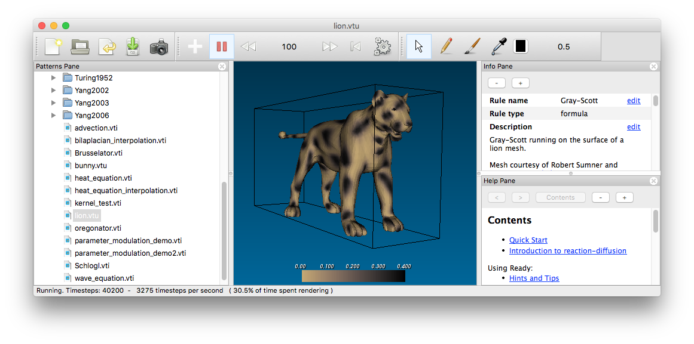

# SELF-ORGANIZING SONIFICATION
## intro to self-organisation

### Topics

* John Conway's *Game of Life*
* Craig Raynold's *Boids*
* Emergence, Perception, Superzeichen
* Artificial Chemistry

### Demos

* Conway's **Game of Life**
* Craig Raynold's **Boids**
* Martin Schneider's **Poetic Polymers**

### Literature

**EMERGENCE** — from Chaos to Order — by [John Holland](https://www3.beacon-center.org/blog/2015/08/13/passing-of-prof-john-holland-father-of-genetic-algorithms-and-pioneer-in-complex-systems/), inventor of Genetic Algorithms.

 

### Software

**GOLLY** — for exploring cellular automata like the Game of Life.

**READY** — for exploring Reaction-Diffusion systems on various grids and meshes

### Resources

* Martin Schneider's [***Self-Organization by Design***](https://www.uni-weimar.de/kunst-und-gestaltung/wiki/GMU:Self-Organization_by_Design) class.
  *  Processing Code for [Computational Systems](https://github.com/bitcraftlab/Self-Organization_by_Design_I), [Geometric Systems](https://github.com/bitcraftlab/Self-Organization_by_Design_II) and [Natural Systems](https://github.com/bitcraftlab/Self-Organization_by_Design_III).
* Dan Shiffman's [***Nature of Code***](http://natureofcode.com/) book
  *  [Processing Code](https://github.com/shiffman/The-Nature-of-Code-Examples)
  *  [P5.js Code](https://github.com/shiffman/The-Nature-of-Code-Examples-p5.js)
