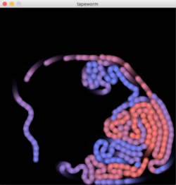
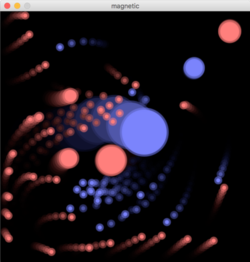
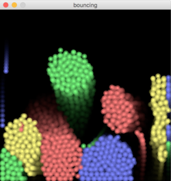

# SELF-ORGANIZING SONIFICATION
## DEMOS
### Intro to Self-Organisation

Three physical / chemical simulations, where simple laws result in emergent patterns and dynamics.

## Tapeworm

1. Assign an ID to each bubble, starting with 1
2. Every bubble follows it's predecessor

  
[processing version](processing/tapeworm) — [p5.js version](p5js/tapeworm)

## Magnetic Bubbles

1. Bubbles of the same color repell each other
2. Bubbles of different colors attract each other

  
[processing version](processing/magnetic_bubbles) — [p5.js version](p5js/magnetic_bubbles)

## Bouncing Bubbles

1. Bubbles of the same color attract each other
2. Bubbles of different colors repell each other
3. Add gravity

  
[processing version](processing/bouncing_bubbles)

