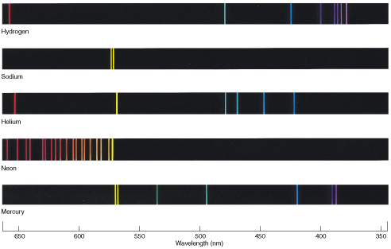
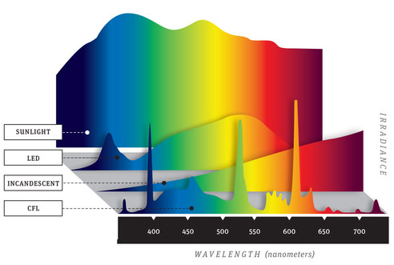
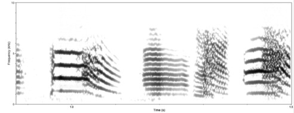
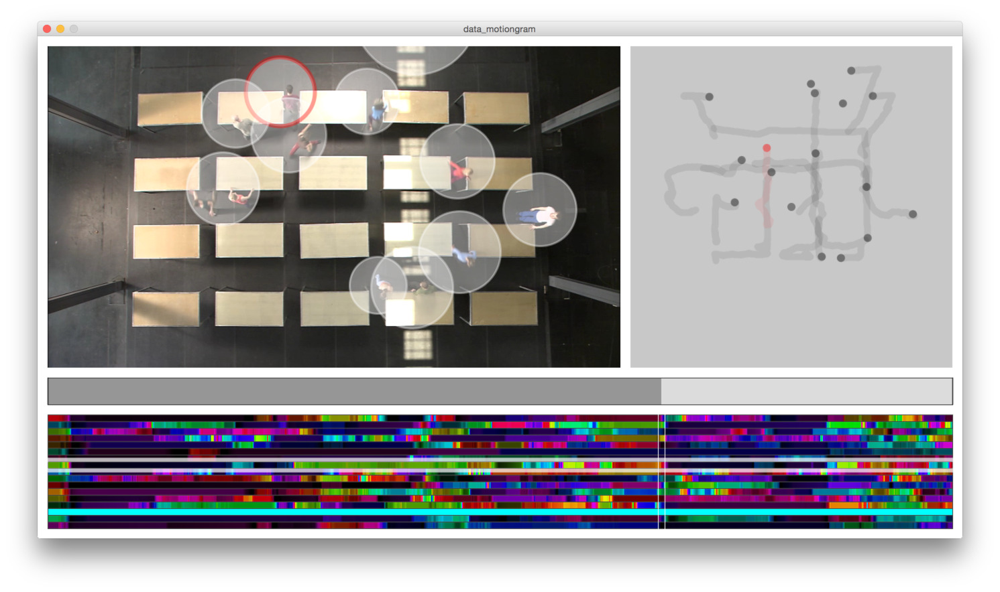

# *SELF-ORGANIZING SONIFICATION*
## 2. MOTIONGRAMS
### Bottom-Up Dataviz inspired by Physics

Motiongrams are a dataviz method used to visualize patterns of motion in a single static image.  
They were inspired by spectrograms which are a popular tool in physics.  

As more and more motion tracking data becomes available motiongrams may be an effective way to visualize and explore motion data.

## Spectrograms

> **Spectrograms are mapping frequency to position.**

### 1D Spectrogram

*The emission spectrum of chemical elements ...*

* wavelength of light → x-axis

### 2D Spectrogram

*The spectral power distribution of lamps ...*

* wavelength of light → x-axis
* energy of light → y-axis

### 3D Spectrogram

*The sound spectrum of field recordings ...*

* frequency of sound → y-axis
* energy → intensity
* time → x-axis

## Motiongrams

> **Motiongrams are mapping motion to color.**

Motiongrams can be **euclidean** or **polaer** depending on the coordinate system used to measure the motion.  
Examples for motiongrams are **Locograms**, **Speedograms**, and **Accelerograms**.

## Demo

### Why Motiongrams?

* Pixelization Paradigm  → High pixel density (one pixel per timestep)
* Motion Patterns → Color Patterns
* Motion patterns repeating in time or across individuals can be identified at a glance
* Motiongrams can serve as a visual score for choreography
* Pixelgraphics as data format

## Single-Point-Motiongrams

Each mover (particle, planet, person, plant ...) is reduced to a single point in space.   Single-Point-Motiongrams are used to visualize the trajectory of this point in space.  

### Locograms

> **Locograms are mapping position to color.**

`f(x,y,z) →  color`

* **Euclidian Locograms**
  * **x-locogram** → color ～ distance along the x-axis
  * **y-locogram** → color ～ distance along the y-axis
  * **z-locogram** → color ～ distance along the z-axis

* **Polar Locograms**
  * **p-locogram** → color ～ distance from a reference point
  * **α-locogram** → hue ～ angle around a reference point

### Speedograms

> **Speedograms are mapping speed to color.**

`f(vx,vy,vz) → color`

* **Euclidian Speedograms**
  * **x-speedogram** → color ～ speed along the x-axis
  * **y-speedogram** → color ～ speed along the y-axis
  * **z-speedogram** → color ～ speed along the z-axis
  * **speedogram** → color ～ speed in space

* **Polar Speedograms**
  * **p-speedogram** → color ～ speed towards a point
  * **α-speedogram** → color ～ angular velocity around a point

### Accelorograms

> **Accelerogram are mapping acceleration to color.**

`f(ax,ay,az) → color`

* **Euclidian Accelerograms**
  * **x-accelogram** → color ～ acceleration along the x-axis
  * **y-accelogram**  → color ～ acceleration along the y-axis
  * **z-accelogram** → color ～ acceleration along the z-axis
  * **accelogram** → color ～ acceleration in space

* **Polar Accelerograms**
  * **p-accelerogram** → color ～ acceleration towards a point
  * **α-accelogram** → color ～ angular acceleration around a point

## Multi-Point-Motiongrams

Single-Point-Motiongrams are only visualizing the motion of single points in space.  
But we maybe interested in the relation of two or more points...

##### Rotograms

> **Rotograms are mapping the direction between two points to a color.**

* Example: direction where an actor is looking / heading / pointing
* Location on a 3D sphere can be mapped to Hue and Value

##### Angugrams

> **Angugrams are mapping the angle between a point and two other points to a color.**

**Example:** Angle for various joints, knees, ankles of an animal.  
* One Agnu-gram for each degree of freedom (DOF) of a joint.

* **Types of Angugrams**

  * 1-DOF-Angugram →  hinge joints, rotary joints
  * 2-DOF-Angugram →  ball joints

## Color-Mapping

We can condense up to three independent motions / degrees of freedom into a single color.  
Sensible choices are:

* 1 linear motion component →  1 gray level or hue gradient
* 1 angular motion component → 1 cylic hue value
* 2 linear motion components → 2 color components (Red and Blue)
* 2 angular motion components →  2 color components (Hue and  Value on a color sphere)
* 3 linear motion components → 3 color components (RGB)
* 2 angular + 1 linear components → 3 color components (HSV in a color globe)
