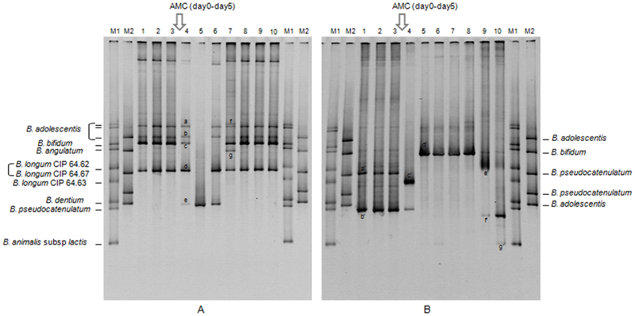

# *SELF-ORGANIZING SONIFICATION*
## 3. DATA-PHORESIS
### Bottom-Up Dataviz inspired by Biology

**Dataphoresis** is a methodol for data analysis and visualization, that is inspired by *gel-electrophoresis*, a technique used in molecular biology to create genetic fingerprints of very long sequences of molecules (typically proteins or DNA).

**This method can be used in silicio in very much the same way, as it is used in vitero!**

We can visualize any sequence, such as **literary texts**, the trajectory of **a dancer**, or **musical compositions** using data phoresis.

### 3 Simple Steps

**Dataphoresis is a three step process:**

1. Use enzymes to cut up sequence into chunks
2. Use a weight function to assign a molecular weight to each of the chunks
3. Create a spectrum by mapping molecular weight along a spacial axis

### Why Dataphoresis?

* Dataphoresis is a way to map high dimensional sequences to low dimensional ones (fingerprinting)
* The fingerprints (dataphoregrams) can be inspected and compared at a glance

When comparing two phoreograms:

1. Identical sequences have identical phoreograms
2. Related Sequences have similar phoreograms
3. Unrelated Sequnces have different phoreograms

### But does it work?

How good is dataphoresis at representing the relatedness of sequences? How good is it at crating a meaningful mapping from the gigantic space of possible data sequences to the much more narrow space of data-phoreograms?

### The Art of Cut-Up

The answer depends critically on the [restriction enzymes](https://en.wikipedia.org/wiki/Restriction_enzyme) we use for cutting up the data sequence!  
There is no straight-forward way to derive optimal enzymes from high-level concepts we consider meaningful such as authorship, language, stylistic properties, etc.

Luckily dataphoresis allows us to spot statistical distributions of various degrees (symbol frequencies, bi-grams, tri-grams ... n-grams) that are significant for these kind of distinctions.

### Evolving Enzymes

If we want to use dataphoresis to identify texts written by the same author, the enzymes should be optimized to cut the texts in locations, that maximize the effectiveness of the data-phoreograms for our purpose.

It may be possibly to improve the enzymes and the weight function via evolutionary algorithms, however this kind of optimization may be un-necessary, since the human visual system is doing most of the work, and it's doing it surprisingly well.

## Discrete Data-Phroesis

Based on the kinds of sequences we are processing we can distinguish several kinds of data phroesis:

* Binary-Phoresis → cutting based on bit-patterns
* Symbol-Phoresis → cutting based on symbols and symbol-patterns
* Alpha-Phoresis → cutting based on letters and letter-patterns
* Lingu-Phoresis → cutting based on words and word-patterns

## Motion-Phoresis

If we have sequences representing continuous motion, or time series, the enzymes may cut when specific values occur in the sequence (*Location-Phoresis*) but they may also cut based on  consecutive values (*Speedo-Phoresis*, *Accellero-Phoresis*).

This technique can be used to crate **Motion-Phorograms**.
Motion-Phoreograms can be used to create concise fingerprints of motion data.

## Weight Functions

### Symbol-Based Weight-Function

Most simple way to implement a weight function:

* weight(symbol) ～ numeric representation (i.e. ASCII value)
* weight(chunk)  ～ sum of all symbols

### Bit-Based Weight-Function

Most universal way to implement a weight function

* weight(bit) ～ value of the bit
* weight(bitstring) ～ sum of bit values

### Corpus-Based Weight function

The weight of a symbol or n-gram of symbols could be a function of it's frequency in a reference corpus, thus ensuring that rare symbols and symbol combinations are lighter, and hence travel further.

A long-tail distribution of rare but characteristic symbols and symbol-combinations will spread out over the phoreogram, while insignificant symbols that are abundant in the reference corpus will tend to cluster on the left.

It remains unclear how much a refrence-corpus based weight function contributes to the quality of the dataphoreograms, and is a great field for future research.
