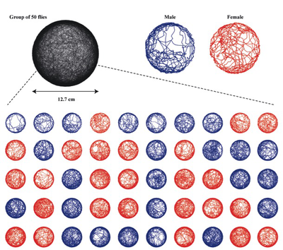
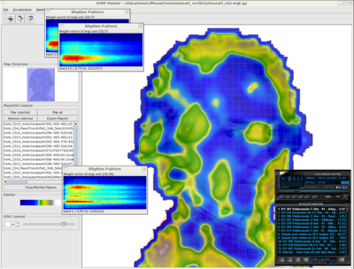
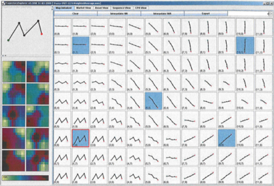

# *SELF-ORGANIZING SONIFICATION*
## 4. MOTIONMAPS
### Bottom-Up Dataviz inspired by Neurology

## Why Motion Maps?

Imagine the trajectory of a fly buzzing through your room.

If you had a long piece of wire you could form it to follow the fly's trail, thus creating a sculptural representation of how the fly moves through space. You could probably identify regions in the wire sculpture that look very much similar, and identify modes of movement. Maybe the fly uses a spiraling motion to gain height, or a zig-zag-like motion to explore the space.

If we look at different flies we may observe similar flight patterns, and we may wonder if there are universal patterns of motion, that may occur across different species, such as a birds, humans, or cleaning robots. This is where motion maps come in handy!

#### What are Motion Maps?

**Motionmaps** are **Self Organizing Maps of Motion** that are used to identify similar parts in a trajectory or across several trajectories of motion.

The basic idea is to take the wire sculpture that represents the flight of a fly and bend it, so that those parts of the wire that looked similar in the orignal sculpture end up in the same place.

Motion maps are very much inspired by Self-Organizing Maps, which  were in turn inspired by the sensor cortex of the human brain. So before we get into Motion Maps let's have a quick look at Self-Organizing Maps (SOMs).

## Self-Organizing Maps

A self-organizing map is yet another way to map high-dimensional stimuli to a two dimensional map.

### Examples

**Mozart SOM** is using a Self-Organizing Map to create a map of music:

#### Motion SOM 

Tatiana von Landesberger uses a SOM for clustering motion trajectories:

### SOMS for Data-Visualization

Self-Organizing Maps arrange the inputs so that:

1. Inputs that are similar end up close to each other
2. Inputs that are dissimlar end up far from each other
3. Clusters of Inputs emerge, that can be used for classification

The Map is made of a grid of cells or neurons each of which contains a vector.  
During a training phase the vectors of our map are tweaked based on the input.

### SOMs in 3 Simple Steps ###

1. Take a random input-vector and throw it at the map
2. Find the winner, i.e. the vector of the map which is most similar to the input
3. A. Tweak the winning vector to become even more like the input-vector  
   B. Tweak the vectors in the neighborhood of the winner, but to a lesser extent

Step 3.A makes sure that after some time each of the inputs will be represented by a single cell.  
Step 3.B is necessary to allow for spacial self-organisation to unfold.

If this process is repeated over and over, the map will slowly self-organize.
Now we just display each input ontop of the orresponding cell of the map and we are done.

## Motion Maps

Now we know how Self-Organizing Maps work, let's look at how Motion Maps are different:  

SOMS:

* SOMs are maps that show the relations between distinct elements (usually represented by vectors). 
* If we use a SOM for trajectories, we have to break them into vector-sized snippets.  

MOTION MAPS:

* Motion Maps can show the similarity of an object with itself
* They do this by tweaking the original trajectory to align it with itsself
* By replaying this transition in time, or making it interactive, we obtain an interactive visualization of self-similarity. 

Motion maps can work for any continuous motion or time series including more abstract ones such as **mathematical fractals**, **stock market evolution**, or **sound curves**.

### How do they work?

Let's just consider planar motions for now:

For each point on our motion trajectory we create a vector that combines spatial motion coding and turtle motion coding. If we initalize each cell of the SOM with the spatial-motion code, that corresponds to its position, each point of the trajectory will be mapped to its original position.

But as soon as we start training the map, similar turtle-code components will start to move closer together because the map is also trained for turtle-motion codes, thus slowly transforming the trajectory.

### Motion Maps in 3 Simple Steps

1. Pick a random section of a fixed size from the motion-sequence
2. Find the winner neuron, i.e. the vector of the map which is most similar to the section
3. A. Tweak the winning vector to become even more like the input-vector  
   B. Tweak the vectors in the neighborhood of the winner, but to a lesser extent

